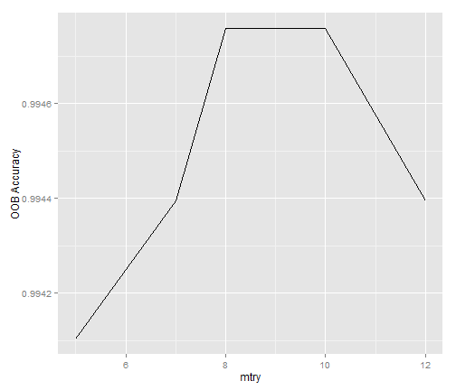
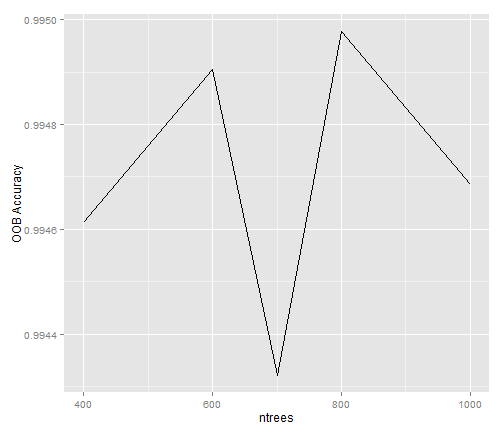

Final Project for Practical Machine Learning
========================================================

## Prediction Problem

The data consists of numerous measurements of body movements, recorded by sensors on the belt, forearm, arm, and dumbell of 6 participants. They were asked to perform barbell lifts in 5 different ways, one correct and 4 incorrect ways. 
The goal of the assignment is to use the data produced by the sensors to predict the way, the barbell lift was performed.  


## Data Preparation

```r
library(randomForest)
```

```
## randomForest 4.6-7
## Type rfNews() to see new features/changes/bug fixes.
```

```r
library(caret)
```

```
## Loading required package: lattice
## Loading required package: ggplot2
```

```r

pml.training <- read.csv("~/Data Science/caret Practial Machine Learning/pml-training.csv")

```


```r
head(pml.training)
summary(pml.training)
```


Taking a first look at the data reveals that there are a lot of NAs and empty values in the data. Since the dataset consists of 19622 observations, it's impossible to get an overview auf how many NAs and empty values exist. So I've used a for loop to count the number of NAs and empty values for each variable.


```r
na.count <- matrix(0, 1, dim(pml.training)[2])
colnames(na.count) <- colnames(pml.training)
for (i in 1:dim(na.count)[2]) {
    na.count[i] <- sum(is.na(pml.training[, i]))
}
em.count <- matrix(0, 1, dim(pml.training)[2])
colnames(em.count) <- colnames(pml.training)
for (i in 1:dim(em.count)[2]) {
    em.count[i] <- sum((pml.training[, i]) == "")
}
```

We can see that the variables have either no NAs/empty values or 19216, almost all of the observations. Hence the informational value of those particular variables is questionable. However, I do not have detailed knowledge of the variables, so it cannot be assumed, that they have no information at all. "Repairing" the variables might be difficult because some also include useless values different from NA and empty values. For the beginning it is convenient to disregard those variables containing almost no usable values and to keep in mind, that they might include information about the classes.


```r
drop.na <- c(which(na.count != "0"))  # select all variables with NAs
drop.em <- c(which(em.count/dim(pml.training)[1] > 0.8))  # select all variables with more than 80 % empty values
```


6 out of the first 7 variables look as if they contain only information about the circumstances of the observations and not actual sensor data, so I remove them as well, except user_name. For most applications this model ought to be trained without names because it will not be very interesting to predict the way of the barbell lift performance for those 6 persons only. Since the prediction assignment does not say whether we should use the names, I included this variable to achieve a higher accuracy.  


```r
drop.manual <- c(1, 3:7)  #manual selection

drop <- c(drop.na, drop.em, drop.manual)  #combine selections

pml.training <- pml.training[, -drop]  #drop selected variables
```


## Model Choice
The relationship between the sensor data and the way a barbell lift is performed is definitely complex and nonlinear. So a linear model might not be a good classifier for this task. On the other hand, the data can be expected to be quite noisy. Even if performed in the same way, the sensor data of barbel lift performances will vary, especially when performed by different people. Random Forest is a good prediction algorithm to handle both complex nonlinear relationships, as well as noisy data. The authors of the dataset also used a model based on Random Forest [Velloso, E.; Bulling, A.; Gellersen, H.; Ugulino, W.; Fuks, H. Qualitative Activity Recognition of Weight Lifting Exercises, p.4] (http://groupware.les.inf.puc-rio.br/public/papers/2013.Velloso.QAR-WLE.pdf), so Random Forests appears to be a good choice.


## Cross Validation and Expected Out of Sample Error
To get an estimate of the out of sample error that is not too optimistic, it's important to use a part of the training set, that has not been used to tune the model. Actually, the Random Forest algorithm automatically leaves out one third of the data to calculate the out-of-bag error and the variable importance [Random Forest Website] (https://www.stat.berkeley.edu/~breiman/RandomForests/cc_home.htm#features). If we use the out-of-bag error to tune the model, we no longer get a realistic estimate of the out of sample error. 
Therefore, I'm splitting the dataset into a 70% training set to build and tune the model and a 30% test set to estimate the out of sample error. 
To split the dataset I use the createDataPartition command from the caret package, which helps to balance splits based on the outcome variable. 
If Random Forest would not leave out one third of the data, we would need to split the data set into three pieces to perform cross-validation. One to build the model, one to tune the model and one to get an error estimate.


```r
set.seed(8484)
pml.training <- pml.training[sample(nrow(pml.training), replace = F), ]
trainindex <- createDataPartition(pml.training$classe, p = 0.7, list = F)
pml.train <- pml.training[trainindex, ]
pml.test <- pml.training[-trainindex, ]

summary(pml.train$user_name)
```

```
##   adelmo carlitos  charles   eurico   jeremy    pedro 
##     2717     2161     2503     2166     2353     1837
```

```r
summary(pml.test$user_name)
```

```
##   adelmo carlitos  charles   eurico   jeremy    pedro 
##     1175      951     1033      904     1049      773
```

I have been worried about the balance of names in the splits, because createDataPartition only assures that the distribution of the outcome variable is balanced. So I shuffled the rows of the data before splitting and took a look at the distribution of user_name in the new sets.

## Model Tuning
Using the implementation of the randomForest package, I first tried different values for the mtrys argument, the number of variables randomly drawn at each split and used to split the node.

The following plot shows the manually computed accuracy of different values for mtry.


```r
library(ggplot2)
qplot(acc[2, ], acc[1, ], geom = "line", ylab = "OOB Accuracy", xlab = "mtry")
```

 


The accuracy was computed, using the confusionmatrix of the randomForest output, which is based on the one third of data that's left out by random forests.
The highest accuracy was to be found using 8 variables for mtry.

After deciding on mtry I tried different values for ntree, the number of trees grown.


```r

qplot(acc.nt[2, ], acc.nt[1, ], geom = "line", ylab = "OOB Accuracy", xlab = "ntrees")
```

 

```r

```


The highest out-of-bag accuracy was achieved with mtry=8 and ntree=800.

```r
rf.8.800 <- randomForest(classe ~ ., data = pml.train, mtry = 8, ntree = 800)
rf.8.800
```

```
## 
## Call:
##  randomForest(formula = classe ~ ., data = pml.train, mtry = 8,      ntree = 800) 
##                Type of random forest: classification
##                      Number of trees: 800
## No. of variables tried at each split: 8
## 
##         OOB estimate of  error rate: 0.55%
## Confusion matrix:
##      A    B    C    D    E class.error
## A 3905    1    0    0    0    0.000256
## B   14 2638    6    0    0    0.007524
## C    0   17 2376    3    0    0.008347
## D    0    0   24 2226    2    0.011545
## E    0    0    1    7 2517    0.003168
```


To get a good estimate for the out of sample error we apply the best model to the test set.


```r
pred8 <- predict(rf.8.800, newdata = pml.test)
confusionMatrix(data = pred8, reference = pml.test$classe)
```

```
## Confusion Matrix and Statistics
## 
##           Reference
## Prediction    A    B    C    D    E
##          A 1674    2    0    0    0
##          B    0 1136    8    0    0
##          C    0    1 1017   22    0
##          D    0    0    1  942    5
##          E    0    0    0    0 1077
## 
## Overall Statistics
##                                         
##                Accuracy : 0.993         
##                  95% CI : (0.991, 0.995)
##     No Information Rate : 0.284         
##     P-Value [Acc > NIR] : <2e-16        
##                                         
##                   Kappa : 0.992         
##  Mcnemar's Test P-Value : NA            
## 
## Statistics by Class:
## 
##                      Class: A Class: B Class: C Class: D Class: E
## Sensitivity             1.000    0.997    0.991    0.977    0.995
## Specificity             1.000    0.998    0.995    0.999    1.000
## Pos Pred Value          0.999    0.993    0.978    0.994    1.000
## Neg Pred Value          1.000    0.999    0.998    0.996    0.999
## Prevalence              0.284    0.194    0.174    0.164    0.184
## Detection Rate          0.284    0.193    0.173    0.160    0.183
## Detection Prevalence    0.285    0.194    0.177    0.161    0.183
## Balanced Accuracy       1.000    0.998    0.993    0.988    0.998
```


The estimated out of sample accuracy of 0.9935 is slightly below the oob accuracy of the dataset we used to tune with, as expected. Still, it's remarkebly high.

## Conclusion
Random Forest seems to perform very well for the recognition of motions using sensor data. 
All of the 20 submissions are correct.


